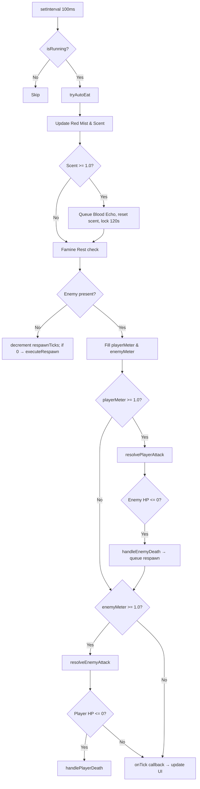
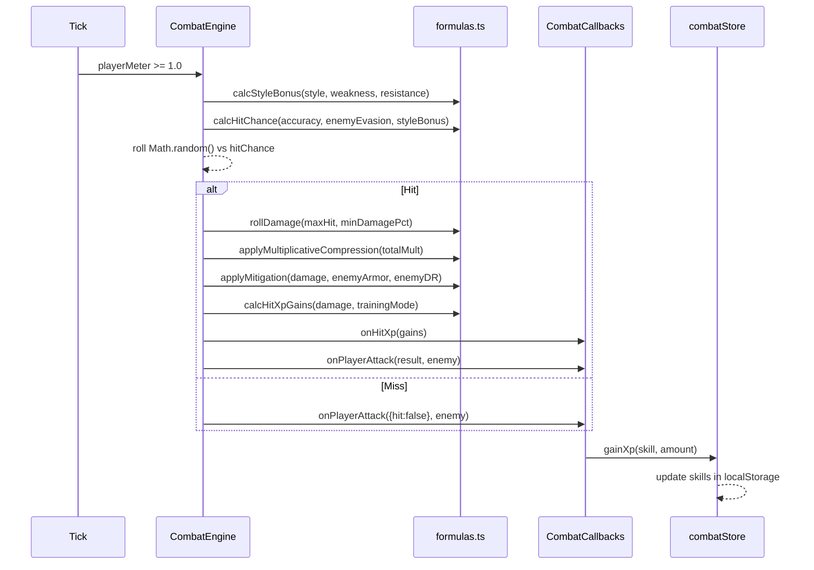

# Crimson Engine — Architecture Guide

## High-Level Architecture

Crimson Engine is a browser-based single-page application (SPA) built on:

- **React 19** — UI rendering
- **Zustand 5** — global reactive state (persisted to `localStorage`)  
- **Vite 6** — dev server and production bundler
- **TypeScript 5.6** — type safety across all layers
- **SCSS Modules** — component-scoped styling

There is **no backend server**. All game logic runs client-side. Persistence is handled via Zustand's `persist` middleware writing to `localStorage`.

---

## Component Layers

```
┌─────────────────────────────────────────────────────────────┐
│  Browser (SPA)                                              │
│  ┌───────────┐  ┌──────────────────────────────────────┐   │
│  │  React UI │  │  Zustand Stores (React glue layer)   │   │
│  │  App.tsx  │  │  playerStore / combatStore /          │   │
│  │  + Views  │◄─┤  skillingStore / notificationStore   │   │
│  └───────────┘  └──────────┬───────────────────────────┘   │
│                             │ reads/writes                  │
│  ┌──────────────────────────▼───────────────────────────┐  │
│  │  Engine Layer (pure TypeScript, no React)            │  │
│  │  CombatEngine  │  formulas.ts  │  progression.ts     │  │
│  │  xpTable.ts    │  constants.ts │  inventoryManager   │  │
│  └──────────────────────────────────────────────────────┘  │
│                                                             │
│  ┌──────────────────────────────────────────────────────┐  │
│  │  Data Layer (static TypeScript definitions)          │  │
│  │  enemies.ts │ zones.ts │ weapons.ts │ armor.ts       │  │
│  │  skilling.ts │ consumables.ts │ bloodEchoes.ts       │  │
│  └──────────────────────────────────────────────────────┘  │
│                             │ persisted via                 │
│  ┌──────────────────────────▼───────────────────────────┐  │
│  │  localStorage (Zustand persist middleware — temporary; will be replaced)  │  │
│  │  Key: "crimson-engine-player"  version: 6                                  │  │
│  └──────────────────────────────────────────────────────┘  │
└─────────────────────────────────────────────────────────────┘
```

---

## Navigation & Views

`App.tsx` manages a single `activeTab` state string. All views are rendered inside a static shell (header + sidenav + content area). There is no router library.

| Tab Key | Component | Description |
|---------|-----------|-------------|
| `profile` | `ProfileView` | Character stats, equipment, skills |
| `inventory` | `InventoryView` | Item management, loot claiming |
| `combat` | `CombatView` | Zone selection → combat arena |
| `sanctum` | `SanctumView` | Distill actions, Crucible, Rituals |
| `store` | `SanguineExchangeView` | Buy weapons/armor/food for shards |
| `bloodletting` | `BloodlettingView` | Bloodletting skilling activity |
| `graveHarvesting` | `SkillingView` | Grave Harvesting nodes |
| `nightForaging` | `SkillingView` | Night Foraging nodes |
| `distillation` | `DistillationView` | Distillation of raw blood |
| `forging` | `SkillingView` | Forging recipes |
| `corpseHarvesting` | `SkillingView` | Corpse processing recipes |
| `alchemy` | `SkillingView` | Alchemy brew recipes |

---

## Zustand Stores

### `playerStore` (`src/store/playerStore.ts`)
The primary stateful store. Persisted to `localStorage` under key `crimson-engine-player` at **schema version 6** (with migration logic for v4, v5, v6).

**State shape:**

| Field | Type | Description |
|-------|------|-------------|
| `skills` | `PlayerSkills` | 13 skills, each `{level, xp}` |
| `equipment` | `PlayerEquipment` | Slots → `EquipmentItem` |
| `food` | `InventoryItem[]` | Consumables for auto-eat |
| `inventory` | `InventoryItem[]` | General inventory |
| `lootHistory` | `LootHistoryItem[]` | Pending loot from combat |
| `bloodShards` | `number` | Primary banked currency |
| `cursedIchor` | `number` | Banked rare reagent |
| `graveSteel` | `number` | Banked crafting material |
| `stabilizedIchor` | `number` | Refined high-tier material |
| `unbankedShards/Ichor/Steel` | `number` | In-session unbanked pool |
| `isBraced` | `boolean` | Vile Reinforcement status |
| `finesseTicksRemaining` | `number` | Sanguine Finesse buff countdown |
| `permanentArmorBonus` | `number` | Flat armor from Vile Reinforcement |
| `activeRituals` | `RitualDefinition[]` | Active pre-hunt rituals |
| `crucibleSealed` | `boolean` | One-action-per-session lock |
| `currentVitae` | `number` | Current HP (persisted) |

### `combatStore` (`src/store/combatStore.ts`)
Manages active combat session state, the combat log, session stats, and the `CombatEngine` instance lifecycle.

### `skillingStore` (`src/store/skillingStore.ts`)
Tracks which skilling node is active, progress timers, and outputs.

### `notificationStore` (`src/store/notificationStore.ts`)
Lightweight toast/notification queue for UI feedback.

---

## Combat Engine (`src/engine/combatLoop.ts`)

`CombatEngine` is a **pure TypeScript class** — zero React imports. It communicates entirely via the `CombatCallbacks` interface passed at construction.

### Lifecycle

```
CombatEngine.start(zone, skills, equipment, ...) 
    → spawnNextEnemy()
    → setInterval(tick, 100ms)   ← TICK_MS = 100

tick():
    → tryAutoEat()
    → update Red Mist / Scent
    → update Famine Rest
    → if enemy: fill attack meters
    → resolvePlayerAttack() when playerMeter >= 1.0
    → resolveEnemyAttack() when enemyMeter >= 1.0
    → onTick(state snapshot)

CombatEngine.stop()
    → clearInterval
```

### Key Properties

| Property | Default | Description |
|----------|---------|-------------|
| `TICK_MS` | 100ms | Heartbeat interval |
| `MIN_ATTACK_INTERVAL` | 0.6s | Attack speed floor |
| `MAX_DAMAGE_REDUCTION` | 0.75 | DR cap (75%) |
| `MIN_HIT_CHANCE` | 0.05 | Hit floor (5%) |
| `MAX_HIT_CHANCE` | 0.95 | Hit ceiling (95%) |
| `SCENT_BUILD_INTERVAL` | 40 ticks | Scent accumulates every 4s |
| `SCENT_INCREMENT` | 0.03/interval | Base scent gain per 4s |
| `BLOOD_ECHO_SCENT_TRIGGER` | 1.0 | Full scent → Blood Echo spawns |
| `SCENT_LOCK_DURATION_MS` | 120,000ms | Post-echo scent lockout |

---

## Skill System

13 skills across two categories:

### Combat Skills
| Skill Key | Role |
|-----------|------|
| `fangMastery` | Melee accuracy & crit source |
| `predatorForce` | Melee max hit |
| `obsidianWard` | Defense / evasion |
| `shadowArchery` | Archery accuracy & max hit |
| `bloodSorcery` | Sorcery accuracy & max hit |
| `vitae` | Max HP (starts at level 10) |
| `bloodletting` | Bloodletting skill activity |

### Non-Combat (Skilling) Skills
| Skill Key | Activity |
|-----------|---------|
| `graveHarvesting` | Mining ruins for materials |
| `nightForaging` | Gathering herbs & flora |
| `forging` | Crafting components |
| `corpseHarvesting` | Processing enemy remains |
| `alchemy` | Brewing consumables & oils |
| `distillation` | Refining raw blood |

XP table lives in `src/engine/xpTable.ts`. Level cap is **120**. XP cap is **500,000,000**.

---

## Game World

### Zones (6 total)

| Zone | ID | Levels | Drop Tier |
|------|----|--------|----------|
| The Forgotten Hamlet | `forgotten_hamlet` | 1–20 | T1 |
| Grimwood Forest | `grimwood_forest` | 21–40 | T2 |
| Blackthorn City | `blackthorn_city` | 41–60 | T3 |
| Catacombs of the Old Empire | `catacombs` | 61–80 | T4 |
| The Crimson Highlands | `crimson_highlands` | 81–100 | T5 |
| The Eternal Night Citadel | `eternal_night_citadel` | 101–120 | T6 |

Each zone has a pool of 6 enemies, cycling weakest → elite. The 6th enemy is always the elite/boss.

### Gear Tiers

T1 → T2 → T3 → T4 → T5 → T6. Tier-shifting requires **Refinement 5** on the current item plus resources.

### Resource Economy

| Resource | Source | Loss on Death (unbanked) |
|----------|--------|--------------------------|
| Blood Shards | Every kill | 50% (25% if Braced) |
| Cursed Ichor | Rare drop, Red Mist bonus | 100% (50% if Braced) |
| Grave Steel | Elite kills, T2+ rare | Retained always |
| Stabilized Ichor | Ichor Stabilization action | Retained always |

---

## Mermaid: Combat Tick Flow



---

## Data Flow: Player Attack Resolution


